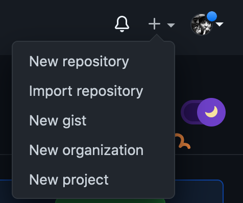
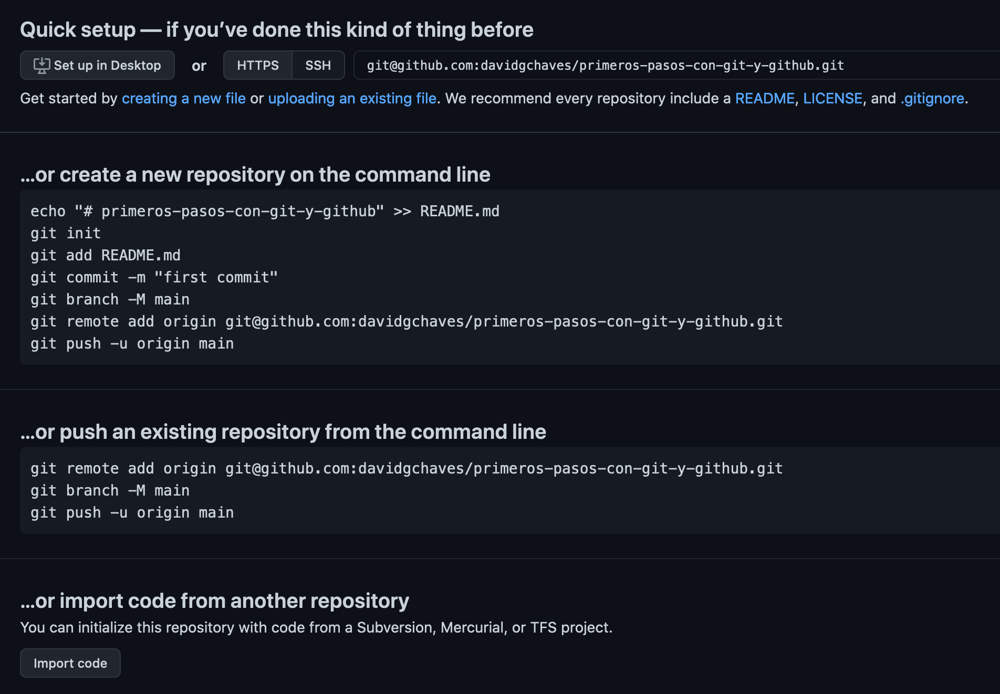
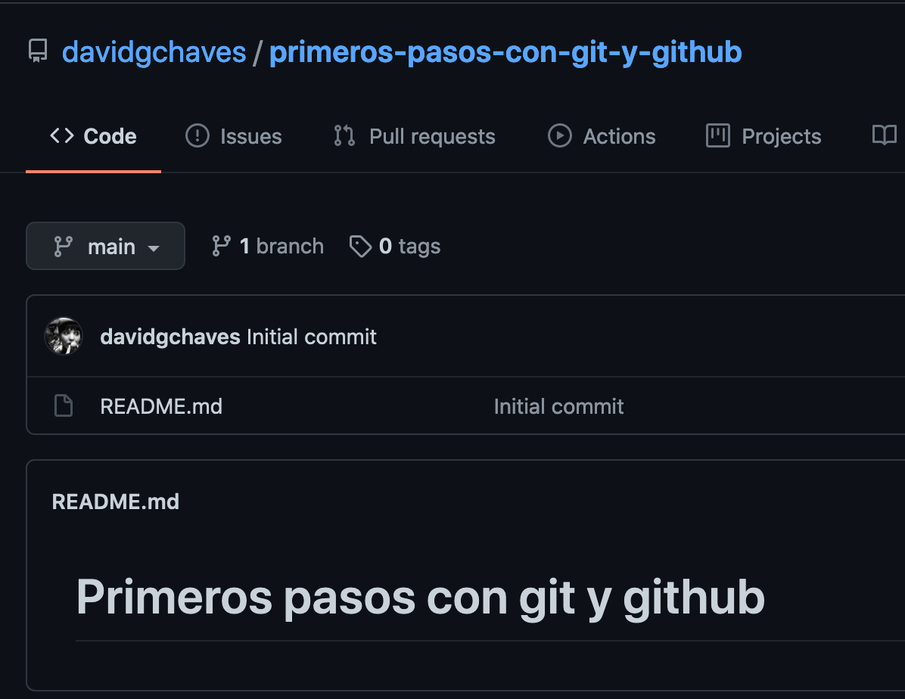
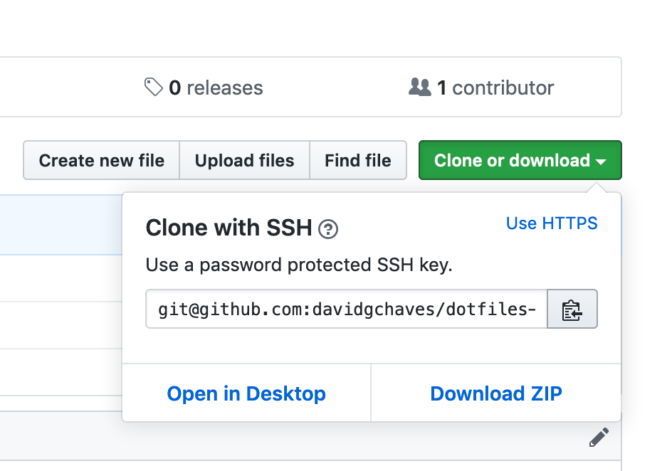

# Primeros pasos con git y github


## Índice

- [1. Links de interés](#1-links-de-interés)
  - [1.1 Markdown](#11-markdown)
  - [1.2 Git y Github](#12-git-y-github)
- [2. Consideraciones previas](#2-consideraciones-previas)
- [3. Receta 1: Instalar git en Ubuntu](#3-receta-1-instalar-git-en-ubuntu)
- [4. Receta 2: Configurar parametros globales de git](#4-receta-2-configurar-parametros-globales-de-git)
- [5. Receta 3: Generar y añadir claves ssh a Github](#5-receta-3-generar-y-añadir-claves-ssh-a-github)
  - [5.1 Links](#51-links)
  - [5.2 Pasos](#52-pasos)
- [6 Receta 4: Crear un repositorio GitHub y asociarlo al repositorio local](#6-receta-4-crear-un-repositorio-github-y-asociarlo-al-repositorio-local)
  - [6.1 Crear un repositorio en GitHub](#61-crear-un-repositorio-en-github)
  - [6.2 Introducir los datos que nos piden](#62-introducir-los-datos-que-nos-piden)
  - [6.3 Crear una carpeta para el repositorio en la máquina local](#63-crear-una-carpeta-para-el-repositorio-en-la-máquina-local)
  - [6.4 Crear el repositorio localmente y enviarlo a Github](#64-crear-el-repositorio-localmente-y-enviarlo-a-github)
- [7 Receta 2: Clonar un repositorio de Github](#7-receta-2-clonar-un-repositorio-de-github)

## 1. Links de interés

### 1.1 Markdown

- [Mastering Markdown Github](https://guides.github.com/features/mastering-markdown/)
- [Markdown Tables Generator ](https://www.tablesgenerator.com/markdown_tables)
- [14 Best Markdown Editors for Linux](https://itsfoss.com/best-markdown-editors-linux/)

### 1.2 Git y Github

- [Juego Learn Git Branching](https://learngitbranching.js.org/)
- [Libro Beginning Git and GitHub](https://www.apress.com/gp/book/9781484253120)
- [Libro Pro Git 2 Online](https://git-scm.com/book/en/v2)

## 2. Consideraciones previas

Las líneas que debemos escribir en la ventana de comandos son las que van despues de un `❯ ` sin el `❯ `.

Por tanto si vemos 👇

```sh
❯ pwd
/Users/davidgchaves/projects
```

debemos escribir, simplemente 👇

```sh
pwd
```

## 3. Receta 1: Instalar git en Ubuntu

> Instalar git en Ubuntu

En una ventana de comandos ejecutamos, uno tras otro, los 3 comandos siguientes 👇

```sh
❯ sudo add-apt-repository ppa:git-core/ppa
❯ sudo apt update
❯ sudo apt install git
```

Comprobamos que todo ha ido bien y que nuestro sistema reconoce `git` 🎉🚀⚡️

```sh
❯ git version
git version 2.24.3 (Apple Git-128)
```

**NOTA**: He ejecutado `git --version` en un OS X y no en un Linux... de ahí el resultado.

## 4. Receta 2: Configurar parametros globales de git

> Configurar parametros globales de git tras instalación

Vamos a configurar **nombre**, **email** y **editor**. Es posible configurar más cosas pero con estas 3, por el momento, tenemos suficiente ☄️

```
❯ cd ~
❯ git config --global user.name "AQUI VA TU NOMBRE"
❯ git config --global user.email AQUI_VA_TU_EMAIL@WHATEVER.COM
❯ git config --global core.editor AQUI_VA_TU_EDITOR
```

Ahora podeis comprobar como ha quedado configurado ejecutando

```sh
❯ git config --list --show-origin
```

## 5. Receta 3: Generar y añadir claves ssh a Github

> Generar y añadir claves ssh para identificarnos en Github

### 5.1 Links

Pasos sacados de:

- [Generar una nueva clave SSH y agregarla al ssh-agent](https://docs.github.com/es/github/authenticating-to-github/generating-a-new-ssh-key-and-adding-it-to-the-ssh-agent)
- [Agregar una clave SSH nueva a tu cuenta de GitHub](https://docs.github.com/es/github/authenticating-to-github/adding-a-new-ssh-key-to-your-github-account)

### 5.2 Pasos

Generamos un par de claves desde el directorio home (`~`)

```sh
❯ cd ~
❯ ssh-keygen -t rsa -b 4096 -C "EMAIL_USADO_EN_REGISTRO_DE_GITHUB"
```

Iniciamos el agente SSH

```sh
❯ eval "$(ssh-agent -s)"
```

Agregamos la **clave privada SSH** al `ssh-agent`

```sh
❯ ssh-add ~/.ssh/id_rsa
```

Instalamos y usamos `xclip` para copiar al portapapeles la **clave pública SSH**

```sh
❯ sudo apt install xclip
❯ xclip -sel clip < ~/.ssh/id_rsa.pub
```

A partir de aquí, seguir los pasos de [Agregar una clave SSH nueva a tu cuenta de GitHub](https://docs.github.com/es/github/authenticating-to-github/adding-a-new-ssh-key-to-your-github-account) **desde el punto 2** en adelante.

## 6 Receta 4: Crear un repositorio GitHub y asociarlo al repositorio local

> Crear un repositorio GitHub y asociarlo al repositorio que tengamos en la máquina local

### 6.1 Crear un repositorio en GitHub

Usar la opción **New Repository** del menu 👇



### 6.2 Introducir los datos que nos piden

Nombre, descripción y determinar si va a ser privado o público.

### 6.3 Crear una carpeta para el repositorio en la máquina local

En el caso de este repositorio, para crear la carpeta debemos primero comprobar que nos encontramos en el directorio correcto `projects`👇

```sh
❯ pwd
/Users/davidgchaves/projects
```

Para a continuación crear el directorio...

```sh
❯ mkdir first-steps-with-git-and-github-ies-illa-de-saron
```

...y entrar en el

```sh
❯ cd first-steps-with-git-and-github-ies-illa-de-saron/
```

Finalmente volvemos a comprobar que estamos donde debemos estar

```sh
❯ pwd
/Users/davidgchaves/projects/first-steps-with-git-and-github-ies-illa-de-saron
```

### 6.4 Crear el repositorio localmente y enviarlo a Github

Debemos seguir las instrucciones que nos da Github. En concreto las de **_…or create a new repository on the command line_**

En el caso de este repositorio, he ampliado algo las instrucciones para que nos resulte más sencillo entender qué estamos haciendo en cada momento. A continuación las lineas de comandos y sus respuestas. Tened en cuenta que las **vuestras pueden variar**.

Creamos el fichero vacio (`touch`) `README.md`

```sh
❯ touch README.md
```

Inicializamos (`init`) el repositorio en nuestra máquina

```sh
❯ git init
Initialized empty Git repository in /Users/davidgchaves/projects/first-steps-with-git-and-github-ies-illa-de-saron/.git/
```

Consultamos el estado (`status`) del repositorio

```sh
❯ git status
On branch master

No commits yet

Untracked files:
  (use "git add <file>..." to include in what will be committed)

	README.md

nothing added to commit but untracked files present (use "git add" to track)
```

Añadimos el `README.md` vacío al _stage_ (`add`) para que `git` sea consciente de su existencia y de que queremos seguirlo (`add`) y posteriormente salvarlo (`commit`)

```
❯ git add README.md
```

Consultamos el estado (`status`) para ver qué ha cambiado y comprobamos que, efectivamente, `git` ya sigue a `README.md`

```sh
❯ git status
On branch master

No commits yet

Changes to be committed:
  (use "git rm --cached <file>..." to unstage)

	new file:   README.md

```

Salvamos (`commit`) nuestra primera versión con un mensaje

```sh
❯ git commit -m "Initial commit"
[master (root-commit) 3838d0e] Initial commit
 1 file changed, 0 insertions(+), 0 deletions(-)
 create mode 100644 README.md
```

Volvemos a comprobar el estado (`status`) del repositorio y vemos que no hay nada que hacer

```sh
❯ git status
On branch master
nothing to commit, working tree clean
```

Consultamos el historial de versiones actual (`log`) y comprobamos que tenemos nuestra primera versión (`commit`).

```sh
❯ git log
3838d0e Initial commit (David G Chaves, 3 minutes ago)
```

**NOTA**: En mi caso salen menos datos que en el vuestro porque tengo la siguiente linea en mi `.gitconfig` 👇 (que podeis añadir al vuestro, si quereis)

```
[format]
	pretty = %C(yellow)%h%Creset %s %C(red)(%an, %cr)%Creset
```

👀 O usar el comando siguiente para que lo haga por vosotros 👇

```sh
❯ git config --global format.pretty "%C(yellow)%h%Creset %s %C(red)(%an, %cr)%Creset"
```

Insertamos un título al `README`

```sh
❯ echo "# first-steps-with-git-and-github-ies-illa-de-saron" >> README.md
```

Comprobamos que ha cambiado el contenido del `README`

```sh
❯ cat README.md
# first-steps-with-git-and-github-ies-illa-de-saron
```

Volvemos a comprobar el estado (`status`) del repositorio y vemos que nos dice que hay cambios listos para enviar al `stage` (`add`)

```sh
❯ git status
On branch master
Changes not staged for commit:
  (use "git add <file>..." to update what will be committed)
  (use "git checkout -- <file>..." to discard changes in working directory)

	modified:   README.md

no changes added to commit (use "git add" and/or "git commit -a")
```

Añadimos los cambios selectivamente (`add -p`)

```sh
❯ git add -p
diff --git a/README.md b/README.md
index e69de29..82f4a78 100644
--- a/README.md
+++ b/README.md
@@ -0,0 +1 @@
+# first-steps-with-git-and-github-ies-illa-de-saron
Stage this hunk [y,n,q,a,d,e,?]? y
```

Volvemos a comprobar el estado (`status`) del repositorio y vemos que ahora sí hay cambios listos para ser salvados (`commit`).

```sh
❯ git status
On branch master
Changes to be committed:
  (use "git reset HEAD <file>..." to unstage)

	modified:   README.md
```

Salvamos (`commit`) nuestra segunda versión con un mensaje

```sh
❯ git commit -m "Add title to README"
[master 6678c20] Add title to README
 1 file changed, 1 insertion(+)
```

Volvemos a comprobar el estado (`status`) del repositorio y vemos que no hay nada que hacer

```sh
❯ git status
On branch master
nothing to commit, working tree clean
```

Consultamos el historial de versiones actual (`log`) y vemos que hay 2 versiones (o `commit`s) de nuestro repositorio.

```sh
❯ git log
6678c20 Add title to README (David G Chaves, 68 seconds ago)
3838d0e Initial commit (David G Chaves, 14 minutes ago)
```

Todos estos **cambios** han ocurrido en **nuestra máquina local**, **GitHub no sabe nada** todavía. Ahora vamos a _enganchar_ nuestro repositorio local con el repositorio creado antes en GitHub.

Añadimos un _remoto_ (`remote`) con la dirección de nuestro repositorio en GitHub

```
❯ git remote add origin git@github.com:davidgchaves/first-steps-with-git-and-github-ies-illa-de-saron.git
```

En el código de 👆, en vuestro caso cambiará el repositorio `git@github.com:davidgchaves/first-steps-with-git-and-github-ies-illa-de-saron.git` que será algo así como `git@github.com:USUARIO/NOMBRE_REPO.git`.

Tras añadir el remoto (`remote`), nuestra máquina local **ya sabe** a dónde enviar los cambios. Es decir, ya sabe cual es el repositorio de Github. De hecho, la convención que se usa es llamar `origin` al repositorio de Github. Por eso el

```
origin git@github.com:USUARIO/NOMBRE_REPO.git
```

Ahora vamos a enviar los datos a Github (`push`) por primera vez

```sh
❯ git push -u origin master
Enter passphrase for key '/Users/davidgchaves/.ssh/id_rsa':
Enumerating objects: 6, done.
Counting objects: 100% (6/6), done.
Delta compression using up to 4 threads
Compressing objects: 100% (3/3), done.
Writing objects: 100% (6/6), 488 bytes | 488.00 KiB/s, done.
Total 6 (delta 0), reused 0 (delta 0)
To github.com:davidgchaves/first-steps-with-git-and-github-ies-illa-de-saron.git
 * [new branch]      master -> master
Branch 'master' set up to track remote branch 'master' from 'origin'.
```

👆 Como yo tengo un `passphrase` para mi clave `ssh`, me la pide. En clase **NO** establecimos ningún `passphrase` por comodidad, por lo que no debería pedírosla. Aun así **ES RECOMENDABLE** establecer un `passphrase` para las claves `ssh`.

Si ahora voy a la dirección de Github en la que está mi repositorio debería cambiar de esto 👇



a esto otro 👇



A partir de ahora cada vez que queramos enviar los datos a Github bastará con `git push` a secas.

```sh
❯ git push
```

## 7 Receta 2: Clonar un repositorio de Github

> Clonar un repositorio de Github

Vamos a clonar un repositorio cualquiera, por ejemplo el [dotfiles-example](https://github.com/davidgchaves/dotfiles-example.git) 👽

Como paso previo, nos situaremos en el directorio raiz correcto

```sh
❯ cd ~/projects
```

A continuación buscaremos y copiaremos la **dirección de clonado ssh** en la interfaz gráfica de github



para finalmente proceder al clonado

```
❯ git clone git@github.com:davidgchaves/dotfiles-example.git
Cloning into 'dotfiles-example'...
Enter passphrase for key '/Users/davidgchaves/.ssh/id_rsa':
remote: Enumerating objects: 15, done.
remote: Total 15 (delta 0), reused 0 (delta 0), pack-reused 15
Receiving objects: 100% (15/15), done.
Resolving deltas: 100% (1/1), done.
```

Ahora podemos acceder localmente al repositorio y consultar lo que queramos

```
❯ cd dotfiles-example/

❯ git status
On branch master
Your branch is up to date with 'origin/master'.

nothing to commit, working tree clean

❯ git log
013daa3 Update README.md (davidgchaves, 1 year, 1 month ago)
3572c0b Add intructions for generating ssh keys (David G Chaves, 1 year, 1 month ago)
3346b9c Add README with instructions (David G Chaves, 1 year, 1 month ago)
e420514 Add gitconfig file (David G Chaves, 1 year, 1 month ago)
47cf7cf Initial commit (David G Chaves, 1 year, 1 month ago)
```
